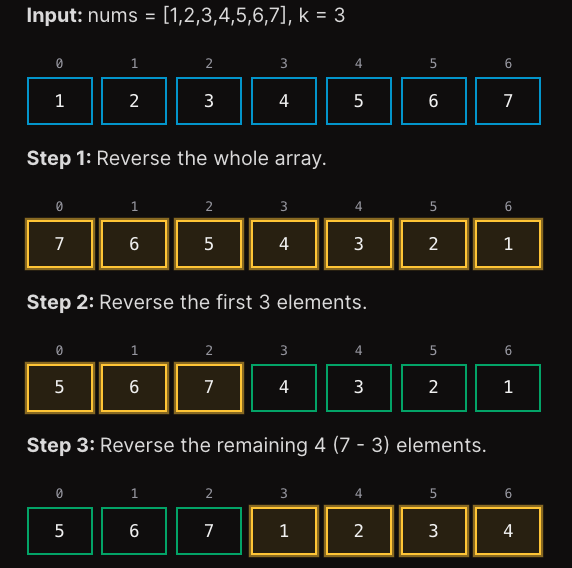

**LeetCode is less about the number of problems you have solved and more about how many patterns you know.**
***

# Problems to learn by heart

## RotateArray

Rotating an array is actually reversing parts of the array

Steps:
- Reverse the whole array
- Reverse the first k elements
- Reverse the remaining n-k elements

