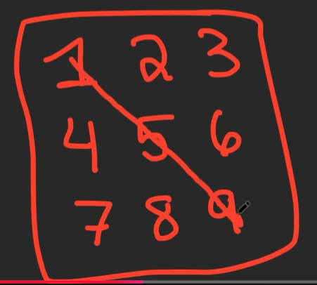
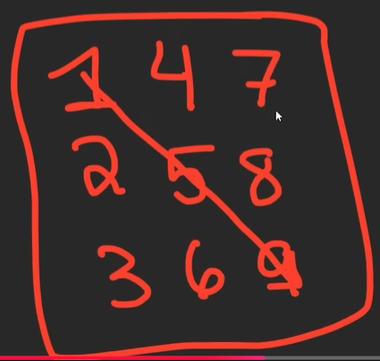

**LeetCode is less about the number of problems you have solved and more about how many patterns you know.**
***

# Note

- Normal binary: left <= right
- Modified binary: left < right
- 2 pointer: left < right

# Problems to learn by heart

## RotateArray

Rotating an array is actually reversing parts of the array

Steps:
- Reverse the whole array
- Reverse the first k elements
- Reverse the remaining n-k elements

## RotateImage

Steps:
- Transpose (chuyển vị):
  - Draw a line down diagonal (Vẽ một đường chéo xuống)
    
  - Swap symmetrical elements ([i][j] -> [j][i])
    
- Reverse each row

## FindPeakElement & FindMinimumInRotatedSortedArray

These 2 problems is contrasting