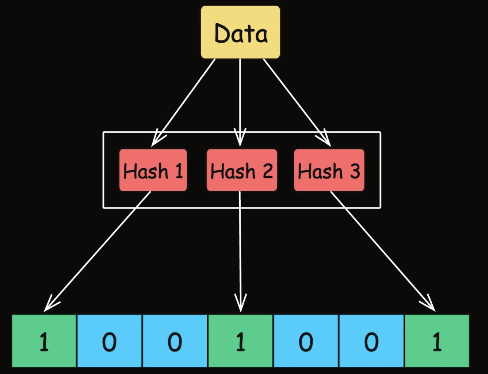

# Bloom Filters

Bloom Filter is a probabilistic data structure that allows to quickly check whether an element might be existed

It's fast, but you need to be okay with occasional false positives

- Define fixed-size bit array, initialized to all 0
- When adding an item, pass through hash functions to find position based on hash value and set 0 to 1
- When checking for existence, pass through the same hash functions. It's definitely not exist if any bit is 0 and probably exist if all bit are 1

Sample use-cases: Recommendation systems avoid showing purchased product

Limitations: False positives, no support for deletion, ...