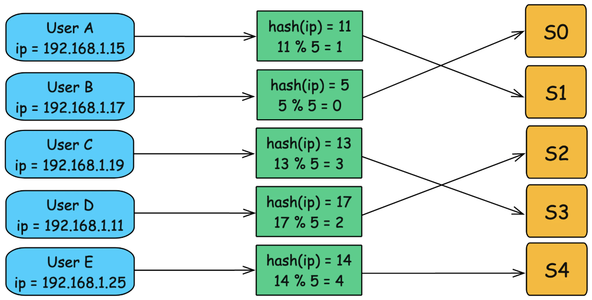
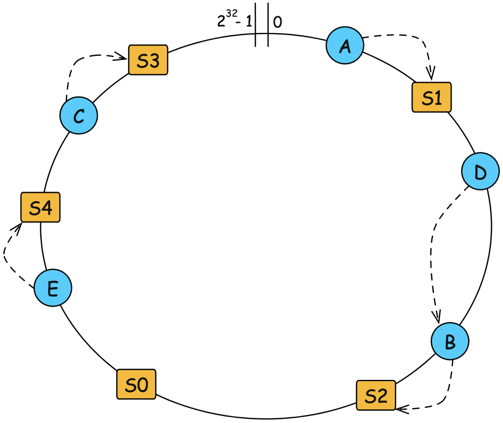
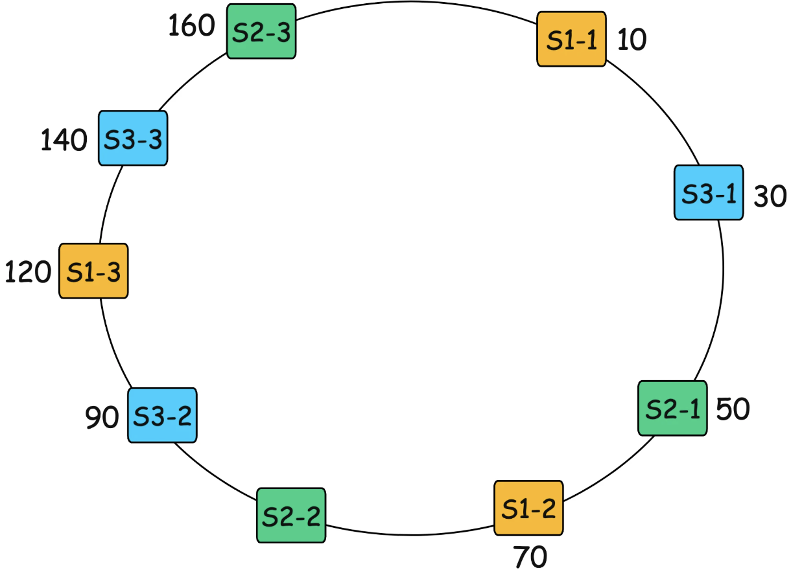

# Consistent Hashing

## The problem with traditional hashing

When scale to add or remove servers, it disrupts the existing mapping and users are reassigned to different servers, which causes:
- massive rehashing
- Active users may be logged out or disconnected

## How consistent hashing works

- Define fixed hash space (mostly from 0 to 2^32 - 1) and hash function like MD5
- Server is assigned a position on the hash ring by hash value
- User’s request is assigned a position on the ring based on the hash value as well. If not fall directly on a server's position, move clockwise until encountering server

To avoid hot spots when number of servers is small, assign multiple positions for a server, this is called virtual node

